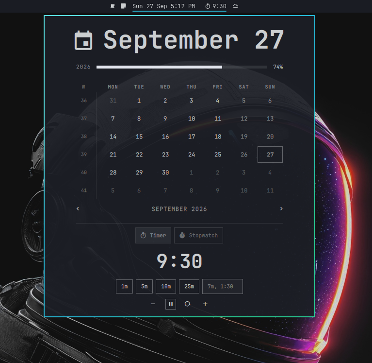

# Clock + Timer for Omarchy

The stock Omarchy bar clock, with a countdown timer and a stopwatch under the calendar.

Click the clock the same way you always do. The calendar opens as usual, and the timer sits underneath it. While a timer or stopwatch is running, the bar shows it next to the time: `Sun 27 Sep 5:04 PM   󰔛 4:32`.



## Features

- **Countdown timer** with one-click presets (1, 5, 10 and 25 minutes by default) and a free-form field that takes `7`, `7m`, `1:30`, `90s`, `1h30`
- **Stopwatch** with tenths of a second in the panel
- **Running time on the bar**, with a ⏸ mark when paused
- **±1 minute** nudges on a running or paused countdown
- **Survives shell restarts.** State is stored as timestamps in `~/.local/state/omarchy/clock-timer.json`, so `omarchy restart shell`, a plugin reload or a crash doesn't lose your timer. If it ran out while the shell was down, you still get notified.
- **Desktop notification and sound** when a countdown ends
- Everything the stock clock does: right-click to cycle formats, middle-click for timezones, the calendar keys, year progress

## Requirements

- Omarchy with the Quickshell-based `omarchy-shell` bar
- `pw-play` (PipeWire, installed with Omarchy) for the finish sound
- `omarchy-notification-send` (ships with Omarchy) for the finish notification

That's all it needs. It uses no network, no sudo and no background service. The only file it writes outside its own folder is its state file, `~/.local/state/omarchy/clock-timer.json`.

## Install

```bash
omarchy plugin add https://github.com/ACooperDev/Timer --enable
```

This is a clone of the stock `omarchy.clock` widget, so enabling it **takes the stock clock's place in the bar** and keeps your existing clock settings (format, week start and so on). Don't run both at once.

## Remove

```bash
omarchy plugin remove acooper.clock-timer
```

This puts the stock Omarchy clock back where it was. To also delete the saved timer state:

```bash
rm -f ~/.local/state/omarchy/clock-timer.json
```

## Update

```bash
omarchy plugin update acooper.clock-timer
```

## Keys (with the calendar open)

| Key | Action |
|-----|--------|
| `s` | Start / pause / resume |
| `r` | Reset |
| `[` `]` `{` `}` `t` `w` | Calendar keys, unchanged |

Press Enter in the custom field to start the timer, or Escape to leave it.

## Settings

In the widget's entry in `~/.config/omarchy/shell.json`:

| Key | Default | |
|-----|---------|---|
| `timerPresets` | `[1, 5, 10, 25]` | Up to six preset durations, in minutes |
| `timerSound` | `/usr/share/sounds/freedesktop/stereo/alarm-clock-elapsed.oga` | Played with `pw-play` when a countdown ends. Set to `""` for silent. |
| `showOnBar` | `"On"` | `"Off"` keeps the bar label clean while a timer runs |

All the stock clock settings (`format`, `formatAlt`, `verticalFormat`, `weekStartDay`, …) still apply.

## IPC

The clone keeps the stock `omarchy.clock` IPC target, so existing bindings still work, and adds:

```bash
omarchy-shell omarchy.clock timerStart 5   # start a 5-minute timer
omarchy-shell omarchy.clock timerToggle
omarchy-shell omarchy.clock timerReset
```

## License

MIT
